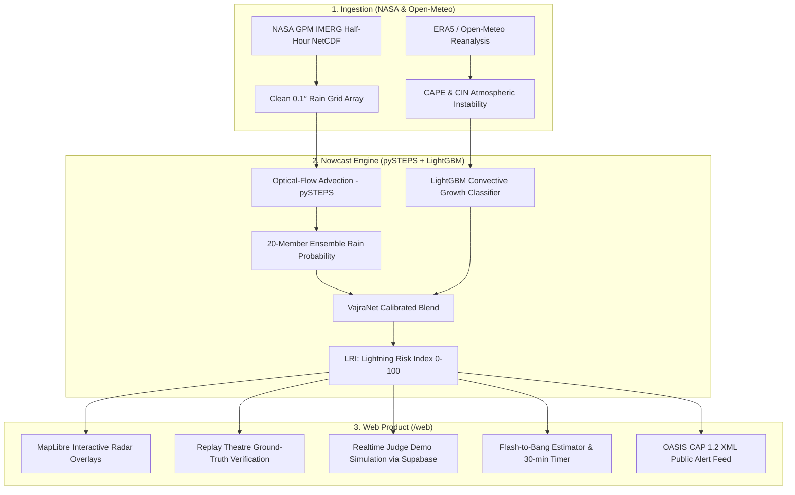

# ⚡ VajraNet — Explainable AI Thunderstorm & Lightning Nowcast

> **SIH26072 Problem Statement Solution**  
> Hyperlocal 0–3 hour precipitation nowcasting and lightning risk index (LRI) using optical-flow extrapolation (pySTEPS) combined with gradient-boosted machine learning (LightGBM).

[](https://nextjs.org/)
[](https://www.typescriptlang.org/)
[](https://tailwindcss.com/)
[](https://maplibre.org/)
[](file:///contracts/constants.json)

---

## 🎯 What is VajraNet?

Official thunderstorm and lightning warnings often cover entire administrative districts (tens of thousands of square kilometers). A farmer in a paddy field, a commuter on a two-wheeler, or a public event organizer cannot tell:
- **Is a thunderstorm heading toward my exact coordinates in the next 0–3 hours?**
- **How many minutes until the squall arrives?**
- **From which compass bearing is it approaching, and at what speed?**
- **What specific safety action must I take right now?**

VajraNet solves this by fusing satellite-derived precipitation tracking with atmospheric convective instability metrics, delivering explainable hyperlocal nowcasts directly to phones.

---

## 🧠 Architecture & Methodology



### Lightning Risk Index (LRI) Formula (Contract v1.0)
$$\text{LRI} = 100 \times \text{clip}\left(0.7 \cdot P_{\text{final}} + 0.3 \cdot \text{clip}\left(\frac{\text{CAPE}}{2500}, 0, 1\right), 0, 1\right)$$

- **Low Risk (0–30):** Clear to light rain, minimal instability.
- **Moderate Risk (30–60):** Building convective cells.
- **Strong Risk (60–80):** High probability of convective precipitation; lightning watch.
- **Severe Risk (80–100):** Imminent squall line; emergency immediate shelter.

---

## 📱 Web Application Pages

| Route | Feature | Purpose |
|---|---|---|
| **`/`** | **Threat Card (Home)** | Hyperlocal LRI radial gauge, arrival ETA, motion vector, tailored persona advice (Farmer, Commuter, Event), and AI diagnostic drawer. |
| **`/replay`** | **Replay Theatre** | Ground-truth verification. Split-screen comparing AI nowcast vs observed satellite rain, with exact *"Alert would have fired at HH:MM"* timestamps and model scorecards. |
| **`/map`** | **Live Radar Map** | Fullscreen MapLibre GL radar map with animated timeline scrubber and precipitation vs probability layers. |
| **`/alerts`** | **Alerts Feed** | Timestamped warning bulletins with one-click **OASIS CAP 1.2 XML** export. |
| **`/flash`** | **Flash-to-Bang** | Interactive lightning-to-thunder distance estimator ($343\text{ m/s}$) with 30-minute shelter buffer timer. |
| **`/settings`** | **Settings & i18n** | Language toggle (English / हिन्दी), contract metrics, and pipeline configuration. |
| **`/control`** | **Judge Demo Console** | Passcode-gated (`vajra2026`) broadcast console to trigger simultaneous simulated storms across judge phones via Supabase Realtime. |

---

## ⚡ Quickstart (Run Locally in Under 3 Minutes)

### Prerequisites
- Node.js 18+ (tested on Node 24)
- Python 3.10+ (for contract validation)

### 1. Run the Web Application
```bash
cd web
npm install
npm run dev
```
Open **[http://localhost:3000](http://localhost:3000)** in your browser.

### 2. Run Contract Validation
```bash
python contracts/validate.py web/public/data-mock
```

### 3. Run Unit Tests
```bash
cd web
npm test
```

---

## 🔒 Environment Secrets

Create `web/.env.local` based on `web/.env.local.example`:
```ini
NEXT_PUBLIC_SUPABASE_URL=https://your-project.supabase.co
NEXT_PUBLIC_SUPABASE_ANON_KEY=your-anon-key
NEXT_PUBLIC_SIM_CHANNEL=vajranet-sim
CONTROL_PASSCODE=vajra2026
NEXT_PUBLIC_DATA_BASE=/data-mock
```
*(All `.env` files are git-ignored and never committed).*

---

## ⚠️ Honest Limitations & Scientific Integrity

- **Satellite vs Radar Resolution:** VajraNet uses NASA GPM IMERG 0.1° (~11 km) satellite-derived estimates, which have latency compared to ground Doppler Weather Radars (DWR).
- **LRI is an Index, Not a Guarantee:** The Lightning Risk Index represents an atmospheric threat score, not an absolute guarantee of a lightning strike at a single coordinate.
- **In-App Alerts:** In this prototype, alerts reach phones when the web application is open. Production implementation requires integration with Common Alerting Protocol (CAP) national gateways and WebPush service workers.
- **Status Exercise:** All generated CAP 1.2 alerts carry `<status>Exercise</status>` to prevent misinterpretation as operational government warnings.
